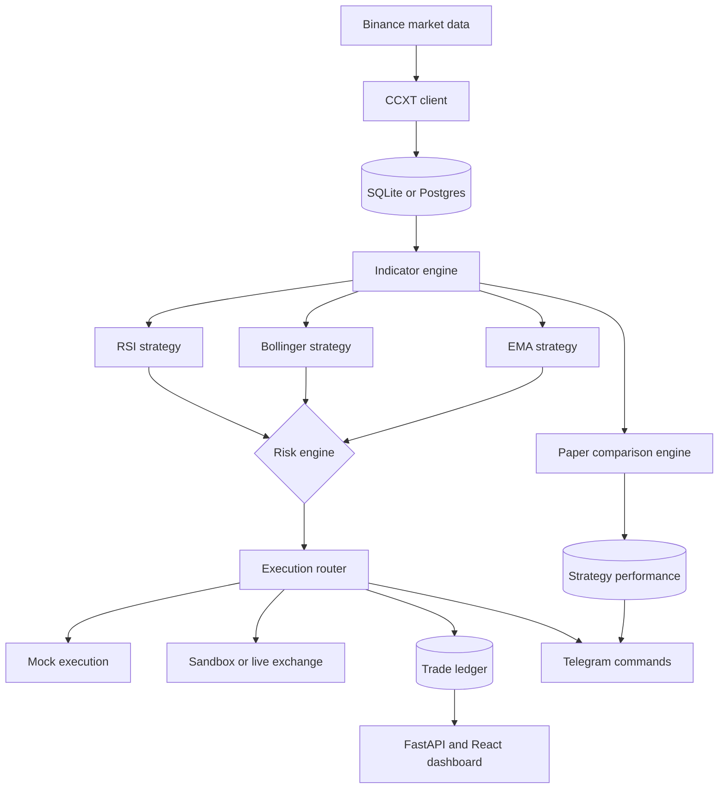

# OneGuard

A safety-first algorithmic cryptocurrency trading bot built in Python. OneGuard combines strict risk guardrails, multi-strategy signal generation, local or hosted telemetry, Telegram controls, and an autonomous paper-trading comparison engine.

The bot is designed to run conservatively: sandbox mode is the default, missing or placeholder exchange keys fall back to local mock execution, and every execution path passes through the risk engine before an order is logged.

---

## Tech Stack

- Python 3.12
- FastAPI + Uvicorn
- React + TypeScript + Vite
- CCXT for Binance market/exchange access
- SQLite locally, optional Postgres via `DATABASE_URL`
- SQLAlchemy
- pandas, NumPy, pandas-ta
- APScheduler
- python-telegram-bot
- Docker and Fly.io deployment support

---

## Latest Updates

Recent changes from the latest git history are reflected here:

- Added an autonomous paper-trading comparison engine that runs RSI, Bollinger Bands, and EMA strategies in isolated virtual portfolios.
- Added paper-trade database tables for `paper_trades` and `strategy_performance`.
- Added Telegram commands for `/leaderboard` and `/papertrades [strategy]`.
- Converted Telegram alerts and bot command output to INR display values using `USDT_INR_RATE`.
- Formatted trade quantities in telemetry alerts to 8 decimal places.
- Added placeholder-key detection so sandbox and development runs fall back to mock execution instead of failing on exchange credentials.
- Added smaller mock-mode defaults: `max_position_size=2.4` USDT and `weekly_drawdown_limit=1.2` USDT when credentials are missing or placeholders.
- Added a unified production runner in `main.py` for the trading pipeline, FastAPI dashboard, and Telegram bot.
- Added Docker and Fly.io deployment files: `Dockerfile`, `fly.toml`, and `.github/workflows/fly-deploy.yml`.
- Disabled duplicate API-side background polling so the scheduler owns ingestion and Binance rate-limit pressure stays lower.
- Added support for hosted dashboard access from GitHub Pages by pointing the frontend to the Fly API URL when needed.

---

## How It Works

OneGuard runs a recurring execution pipeline:

1. Fetch market candles through CCXT.
2. Persist candles to the database.
3. Calculate RSI, EMA, and Bollinger Band indicators.
4. Evaluate all strategies.
5. Validate any trade request through the risk engine.
6. Execute live, sandbox, or mock orders.
7. Log trades, paper trades, fees, and PnL.
8. Push telemetry and command responses to Telegram.
9. Serve bot state, charts, metrics, settings, and trade history through the dashboard API.



---

## Risk Engine Guardrails

Before an order reaches live, sandbox, or mock execution, it must pass the central safety layer:

- `EMERGENCY_HALT=TRUE` pauses new executions.
- Weekly realized drawdown is capped.
- A loss cooldown blocks immediate re-entry after realized losses.
- Duplicate open positions per symbol are blocked.
- Total open positions are capped by `MAX_OPEN_TRADES`.
- SELL orders are strategy-aware and validated against the owning strategy path.
- Stop-loss and take-profit checks are run against open positions.

Defaults are intentionally smaller in mock mode. If Binance keys are missing or still set to placeholders, OneGuard uses local mock execution and adjusts default risk settings to a smaller sandbox budget.

---

## Strategies

| Strategy | Signal Logic | Indicators |
|---|---|---|
| RSI Mean Reversion | BUY on oversold threshold crossover, SELL on overbought threshold crossover. | RSI 14 |
| Bollinger Band Bounce | BUY/SELL based on lower and upper band interactions. | Bollinger Bands |
| EMA Crossover | BUY on fast EMA crossing above slow EMA, SELL on fast EMA crossing below slow EMA. | EMA 9, EMA 21 |

The paper engine runs all three strategies in parallel with isolated virtual positions, 2% stop-loss, 4% take-profit, and a simulated 0.1% fee.

---

## Setup

### 1. Clone the repository

```bash
git clone https://github.com/Ashborn-047/one-guard.git
cd one-guard
```

### 2. Create and activate a virtual environment

```bash
python -m venv venv
```

Windows PowerShell:

```powershell
.\venv\Scripts\Activate.ps1
```

Linux or macOS:

```bash
source venv/bin/activate
```

### 3. Install Python dependencies

```bash
pip install -r requirements.txt
```

### 4. Install frontend dependencies

```bash
cd dashboard/frontend
npm install
cd ../..
```

### 5. Configure environment variables

```bash
cp .env.example .env
```

Edit `.env` with your credentials and runtime settings.

Important variables:

| Variable | Purpose |
|---|---|
| `ONEGUARD_MODE` | `sandbox` or `live`. Sandbox is recommended until fully verified. |
| `BINANCE_API_KEY` / `BINANCE_SECRET_KEY` | Binance credentials. Placeholder or missing values trigger mock execution. |
| `TELEGRAM_BOT_TOKEN` / `TELEGRAM_CHAT_ID` | Enables Telegram alerts and commands. |
| `DATABASE_FILE` | Local SQLite database file. |
| `DATABASE_URL` | Optional hosted Postgres connection string. |
| `USDT_INR_RATE` | INR display conversion rate for Telegram output. Defaults to `83.33`. |
| `EMERGENCY_HALT` | Set to `TRUE` to pause new execution cycles. |

Keep withdrawals disabled on exchange API keys. Trade and read permissions are enough for this project.

---

## Running Locally

### Unified app runner

Runs the trading pipeline, FastAPI dashboard, and Telegram bot process together:

```bash
python main.py
```

Dashboard/API:

```text
http://localhost:8000
```

### Development dashboard launcher

Runs the FastAPI API on port `8000` and the Vite frontend on port `5173`:

```bash
python run_dashboard.py
```

Frontend:

```text
http://localhost:5173
```

### Pipeline only

Run one cycle:

```bash
python -m src.pipeline --once
```

Run the scheduler:

```bash
python -m src.pipeline
```

---

## Telegram Commands

When `TELEGRAM_BOT_TOKEN` and `TELEGRAM_CHAT_ID` are configured, the Telegram bot supports:

| Command | Description |
|---|---|
| `/status` | Shows mode, halt status, max trade size, and paper-trading summary. |
| `/pause` | Activates emergency halt. |
| `/resume` | Clears emergency halt. |
| `/trade` | Triggers a manual pipeline evaluation cycle. |
| `/mocktrade <buy|sell> <symbol>` | Executes a manual mock/simulated trade. |
| `/leaderboard` | Shows strategy comparison performance. |
| `/papertrades [strategy]` | Shows recent paper trades, optionally filtered by RSI, BB, or EMA. |

Telegram trade alerts display INR prices/PnL and quantities with 8 decimal places.

---

## Dashboard API

The FastAPI service exposes:

| Endpoint | Purpose |
|---|---|
| `GET /api/status` | Execution mode, halt state, risk settings, and mock-mode flag. |
| `GET /api/metrics` | Trade counts, realized PnL, win rate, profit factor, and drawdown status. |
| `GET /api/positions` | Active positions with live valuation, SL, and TP levels. |
| `GET /api/chart` | Candles plus EMA, RSI, and Bollinger data for the frontend chart. |
| `GET /api/trades` | Historical trade ledger, with exchange sync when real keys are configured. |
| `GET /api/symbols` | Symbols available in the candle database. |
| `POST /api/settings` | Updates mode, halt, and guardrail settings dynamically. |

The React dashboard can run locally through Vite or be served from the built `dashboard/frontend/dist` bundle by FastAPI.

---

## Deployment

The repository includes deployment support for Fly.io:

- `Dockerfile` builds the Python app and bundled React dashboard.
- `fly.toml` targets the `bom` region and exposes port `8000`.
- `.github/workflows/fly-deploy.yml` deploys on pushes to `main` when `FLY_API_TOKEN` is configured as a GitHub secret.

Manual deploy:

```bash
flyctl deploy --remote-only
```

Build the frontend before deploying if frontend source changed:

```bash
cd dashboard/frontend
npm run build
cd ../..
```

---

## Verification

Run the Python test suite:

```bash
python -m unittest tests/test_risk_and_strategies.py
```

Build the frontend:

```bash
cd dashboard/frontend
npm run build
cd ../..
```

---

## Project Files

| Path | Purpose |
|---|---|
| `main.py` | Unified production runner. |
| `src/pipeline.py` | Scheduled market ingestion, indicators, strategy evaluation, execution, and paper cycle. |
| `src/execution.py` | Exchange/mock order execution and trade logging. |
| `src/risk.py` | Safety guardrails and position sizing. |
| `src/paper_engine.py` | Autonomous paper-trading strategy comparison. |
| `src/telegram_bot.py` | Telegram command handlers. |
| `src/telemetry.py` | Telegram alert formatting/sending. |
| `src/db.py` | SQLite/Postgres schema and data access. |
| `dashboard/api.py` | FastAPI telemetry and settings API. |
| `dashboard/frontend/` | React dashboard. |
| `doc/` | Architecture notes, milestones, and implementation planning docs. |

---

## Notes

- Start in `sandbox` or mock mode.
- Missing or placeholder Binance keys are intentionally treated as mock execution.
- Keep `.env` out of version control.
- Use real API keys only after paper results and risk settings have been reviewed.
- The dashboard API throttles exchange trade sync and avoids duplicate background market polling to reduce rate-limit risk.
