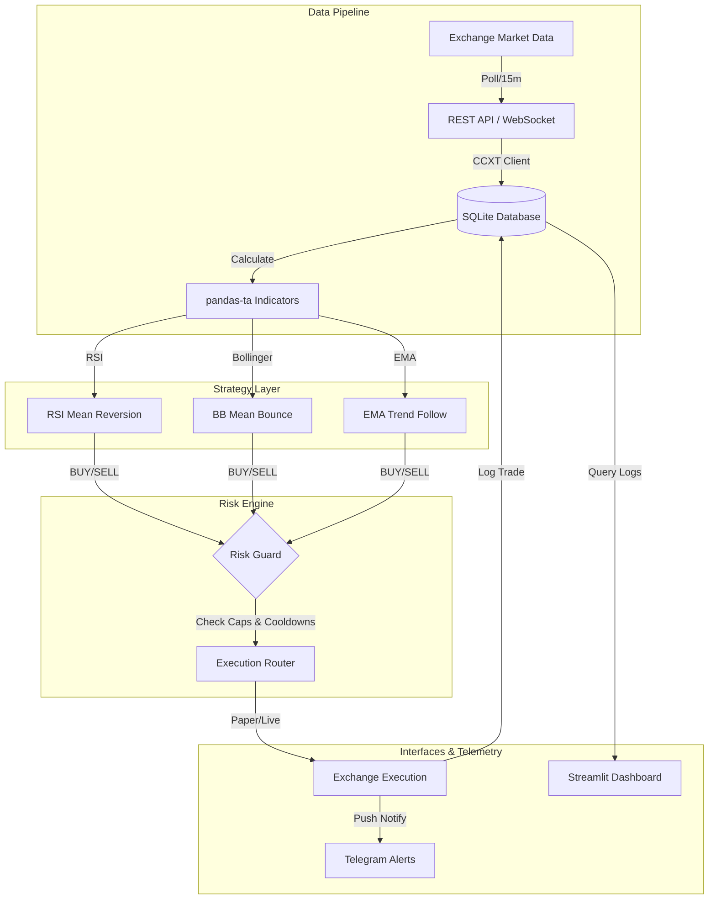

# OneGuard 🛡️

A disciplined, safety-first algorithmic cryptocurrency trading bot built in Python. Designed to run on small capital (starting with ₹1,000/week) with strict, hard-coded risk management safeguards, multi-strategy signals, and real-time dashboard telemetry.

---

## ◈ System Architecture

OneGuard is structured with modularity, decoupling data ingestion from logic validation and trade execution:



---

## ◈ Directory Structure

```
├── doc/
│   ├── 01_goals_and_vision.md         # High-level vision, mission, and guiding principles
│   ├── 02_step_by_step_process.md     # Sequential 9-step implementation roadmap
│   ├── 03_known_hurdles.md            # Technical risk log and mitigations
│   ├── 04_milestones_and_targets.md   # Numeric goals and compounding schedules
│   └── 05_tech_phases.md              # Technical phases, tech stack specifications
├── src/
│   ├── __init__.py
│   ├── pipeline.py                    # Data fetching, indicator calculation, SQLite sync
│   ├── strategies/
│   │   ├── __init__.py
│   │   ├── base.py                    # Base strategy class
│   │   ├── rsi.py                     # RSI Mean Reversion Strategy
│   │   ├── bb.py                      # Bollinger Band Bounce Strategy
│   │   └── ema.py                     # EMA Crossover Strategy
│   ├── risk.py                        # Risk Management Engine (Caps, Cooldowns, SL/TP)
│   ├── execution.py                   # Order execution router (REST/WebSocket)
│   ├── dashboard.py                   # Streamlit local analytics dashboard
│   └── alerts.py                      # Telegram bot message handler
├── tests/                             # Unit tests for strategies and risk guards
├── .env.example                       # Example environment file (API keys config)
├── .gitignore                         # Strict rules ignoring credentials & local DBs
├── README.md                          # Master overview
├── requirements.txt                   # Dependency list
└── trading-bot-masterplan.html        # Original project masterplan
```

---

## ◈ Modular Documentation

For deep dives into specific areas of the master plan, refer to the following source-of-truth files in the `doc/` directory:

1. 🎯 [**Goals & Vision**](file:///e:/My%20Projects/Crypto%20Bot/doc/01_goals_and_vision.md): Read about the ultimate mission, project goals (G1-G5), and our guiding core principles.
2. 📋 [**Step-by-Step Process**](file:///e:/My%20Projects/Crypto%20Bot/doc/02_step_by_step_process.md): Detailed 9 steps from initial environment setup to going live.
3. ⚠️ [**Known Hurdles & Mitigation**](file:///e:/My%20Projects/Crypto%20Bot/doc/03_known_hurdles.md): Detailed runbook for handling rate-limits, connectivity losses, fee drag, and emotional biases.
4. 📈 [**Milestones & Performance Targets**](file:///e:/My%20Projects/Crypto%20Bot/doc/04_milestones_and_targets.md): Weekly performance benchmarks, risk limits (max drawdown < 8%), and a compounding ROI projection table.
5. ⚙️ [**Technical Development Phases**](file:///e:/My%20Projects/Crypto%20Bot/doc/05_tech_phases.md): Comprehensive breakdown of the 7 tech phases, stack specifications, strategies, and pre-launch checklists.

---

## ◈ Tech Stack

* **Language:** `Python 3.10+`
* **Exchange Library:** `CCXT`
* **Analysis:** `pandas`, `numpy`, `pandas-ta`
* **Database:** `SQLite`
* **Scheduling:** `APScheduler`
* **Dashboard:** `Streamlit`
* **Alerting:** `Telegram Bot API`

---

## ◈ Setup & Installation

### 1. Clone the repository and navigate to the project directory:
```bash
git clone https://github.com/your-username/one-guard.git
cd one-guard
```

### 2. Set up the virtual environment:
```bash
python -m venv venv
# On Windows (PowerShell):
.\venv\Scripts\Activate.ps1
# On Linux/macOS:
source venv/bin/activate
```

### 3. Install dependencies:
```bash
pip install -r requirements.txt
```

### 4. Configure credentials:
Copy `.env.example` to `.env` and fill in your details:
```bash
cp .env.example .env
```
> [!CAUTION]
> Never commit the `.env` file to version control. Ensure it is listed in `.gitignore`. Ensure exchange keys have **Read/Write (Trading)** enabled, but **Withdrawals** strictly disabled.
