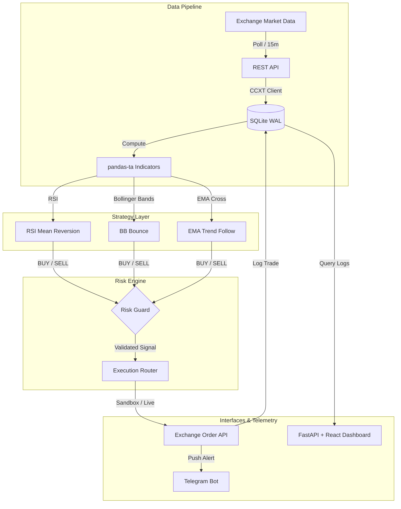

# OneGuard 🛡️

A disciplined, safety-first algorithmic cryptocurrency trading bot built in Python. Designed around strict, hard-coded risk management guardrails, multi-strategy signal generation, and a real-time telemetry dashboard — built to trade responsibly, transparently, and autonomously.

---

## 🛠️ Tech Stack & Integrations

<p align="left">
  <a href="https://www.python.org/">
    
  </a>
  <a href="https://fastapi.tiangolo.com/">
    
  </a>
  <a href="https://react.dev/">
    
  </a>
  <a href="https://www.typescriptlang.org/">
    
  </a>
  <a href="https://vite.dev/">
    
  </a>
  <a href="https://www.sqlite.org/index.html">
    
  </a>
  <a href="https://ccxt.com/">
    
  </a>
  <a href="https://pandas.pydata.org/">
    
  </a>
  <a href="https://numpy.org/">
    
  </a>
  <a href="https://framer.com/motion/">
    
  </a>
  <a href="https://telegram.org/">
    
  </a>
</p>

---

## ◈ How It Works

OneGuard operates as a fully automated execution pipeline. Every 15 minutes, it polls live market data, computes technical indicators, evaluates strategy signals, validates them through a centralized risk engine, and routes approved orders to the exchange — all while broadcasting real-time alerts to Telegram and serving telemetry to a dashboard interface.



---

## ◈ Risk Engine Guardrails

Before any order reaches the exchange, it must pass a strict security and capital evaluation layer:

*   **Emergency Halt Switch** — `EMERGENCY_HALT=TRUE` in `.env` instantly suspends all execution loops.
*   **Weekly Drawdown Cap** — Auto-halts the bot if weekly realized losses exceed the configured limit (default: `$15.00 USDT`).
*   **Loss Cooldown** — A 30-minute block activates automatically after any trade ends in a realized loss, mitigating emotional revenge trading.
*   **Duplicate Position Guard** — Restricts the bot to only one open position per symbol at any time.
*   **Max Concurrent Trades Cap** — Caps open positions at a maximum of 3 across all symbols to protect capital.
*   **Strategy Isolation Lock** — Exit (SELL) orders are strictly validated to ensure they are processed by the same strategy module that initiated the entry (BUY) order.

---

## ◈ Strategies

| Strategy | Signal Logic | Timeframe | Indicators |
|---|---|---|---|
| **RSI Mean Reversion** | BUY when RSI < 30 (oversold region), SELL when RSI > 70 (overbought region). | 15m | RSI (14) |
| **Bollinger Band Bounce** | BUY when close crosses below lower band, SELL when close crosses above upper band. | 15m | Bollinger Bands (20, 2) |
| **EMA Crossover** | BUY on Golden Cross (EMA 9 crossed above EMA 21), SELL on Death Cross. | 15m | EMA (9), EMA (21) |

---

## ◈ Setup & Installation

### 1. Clone the repository
```bash
git clone https://github.com/Ashborn-047/one-guard.git
cd one-guard
```

### 2. Set up the virtual environment
```bash
python -m venv venv

# Windows (PowerShell)
.\venv\Scripts\Activate.ps1

# Linux / macOS
source venv/bin/activate
```

### 3. Install dependencies
```bash
pip install -r requirements.txt
```

### 4. Configure environment
```bash
cp .env.example .env
```
Edit `.env` with your Binance API credentials and Telegram bot details.

> [!CAUTION]
> Never commit `.env` to version control. Exchange API keys must have **Read + Trade** permissions only — **Withdrawals must be strictly disabled**.

---

## ◈ How to Run

### Command Center Dashboard
Start the unified control panel (FastAPI backend + Vite React frontend running concurrently):
```bash
python run_dashboard.py
```
*   **API Telemetry Port:** `http://localhost:8000`
*   **Frontend Dashboard Port:** `http://localhost:5173`

### Execution Pipeline

#### 1. Run in Sandbox / Paper mode (Single iteration)
```bash
python -m src.pipeline --once
```

#### 2. Run the continuous Cron Scheduler
```bash
python -m src.pipeline
```

---

## ◈ Development Progress & Lifecycle

Track real-time implementation progress, module health, and developer logs in the interactive project command center:
```
project_status.html  ← open in any browser
```

The system progress is broken down into 7 milestone phases:

1.  **Phase 1: Environment & Tooling** — Setup, credentials isolation, and settings validator class. `[100% Complete]`
2.  **Phase 2: Ingestion & Indicators** — CCXT exchange fetchers, SQLite WAL cache tables, and `pandas-ta` indicator engine. `[100% Complete]`
3.  **Phase 3: Core Logic & Risk Engine** — Centralized risk guards, strategy module definitions, execution routing logic, and scheduler loop. `[100% Complete]`
4.  **Phase 4: Telemetry & Dashboard** — Non-blocking Telegram alerting, FastAPI endpoints, Vite React glassmorphic UI, and TradingView charting. `[100% Complete]`
5.  **Phase 5: Continuous Sandbox Paper Trading** — Dry-run testing on Binance Testnet, clock sync validation checks, and multi-day stability test cycles. `[In Progress]`
6.  **Phase 6: Strategy Selection & Validation** — Statistical metrics analysis over 2–3 weeks to assert win rate > 55%. `[Planned]`
7.  **Phase 7: Go Live** — Live API permissions check, VPS daemonization, and capital scaling configuration. `[Planned]`

---

## ◈ Verification & Quality Assurance

Always run unit tests before proposing or committing code changes:
```bash
python -m unittest tests/test_risk_and_strategies.py
```

---

## ◈ Documentation

Deep-dive architectural decisions and system limits are stored in the `doc/` directory:

*   🎯 [Goals & Vision](file:///e:/My%20Projects%20/%20Crypto%20Bot/doc/01_goals_and_vision.md) — Product mission and core tenets
*   📋 [Step-by-Step Process](file:///e:/My%20Projects%20/%20Crypto%20Bot/doc/02_step_by_step_process.md) — 9-step implementation roadmap
*   ⚠️ [Known Hurdles](file:///e:/My%20Projects%20/%20Crypto%20Bot/doc/03_known_hurdles.md) — Exchange weight limit rules, clock offsets, and SQLite concurrency mitigation
*   📈 [Milestones & Performance Targets](file:///e:/My%20Projects%20/%20Crypto%20Bot/doc/04_milestones_and_targets.md) — Statistics targets, drawdown checks, and budget allocations
*   ⚙️ [Technical Development Phases](file:///e:/My%20Projects%20/%20Crypto%20Bot/doc/05_tech_phases.md) — Developmental phase breakdown and requirements
