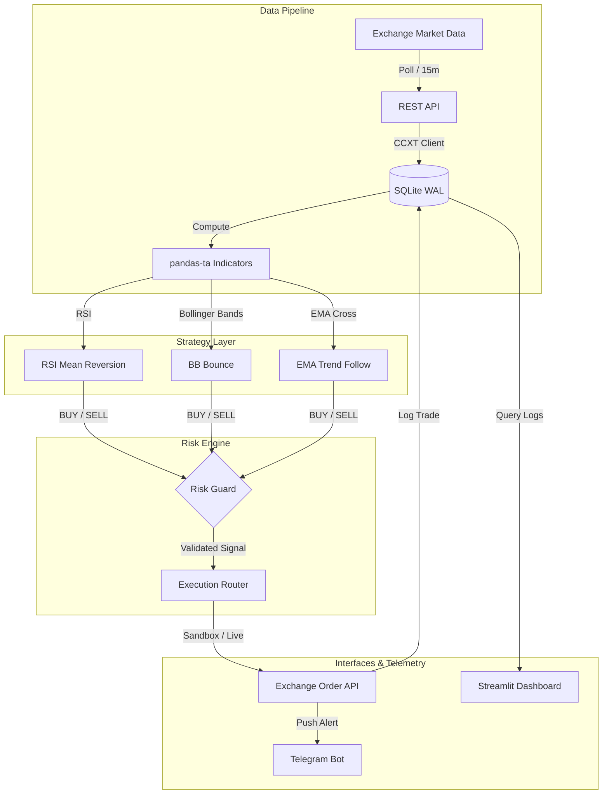

# OneGuard 🛡️

A disciplined, safety-first algorithmic cryptocurrency trading bot built in Python. Designed around strict, hard-coded risk management guardrails, multi-strategy signal generation, and real-time telemetry — built to trade responsibly and autonomously.

---

## ◈ How It Works

OneGuard operates as a fully automated execution pipeline. Every 15 minutes, it polls live market data, computes technical indicators, evaluates strategy signals, validates them through a centralized risk engine, and routes approved orders to the exchange — all while broadcasting real-time alerts to Telegram.



---

## ◈ Tech Stack

| Layer | Technology |
|---|---|
| **Language** | Python 3.10+ |
| **Exchange Connectivity** | CCXT 4.x (Binance, Sandbox + Live) |
| **Technical Analysis** | pandas-ta, pandas, numpy |
| **Database** | SQLite 3 (WAL mode for concurrent reads) |
| **Scheduling** | APScheduler 3.x (cron-based 15m intervals) |
| **Telemetry** | Telegram Bot API (python-requests) |
| **Dashboard** | Streamlit + Plotly |
| **Testing** | Python unittest |
| **Environment** | python-dotenv, frozen dataclass config |

---

## ◈ Risk Engine Guardrails

Every signal is evaluated against a centralized safety layer before any order reaches the exchange:

- **Emergency Halt Switch** — `EMERGENCY_HALT=TRUE` in `.env` instantly suspends all execution
- **Weekly Drawdown Cap** — Auto-halt triggers if weekly realized loss breaches the configured threshold
- **Loss Cooldown** — A 30-minute suspension activates automatically after any realized loss
- **Duplicate Position Guard** — Only one open position per symbol allowed at any time
- **Max Concurrent Trades Cap** — Hard limit on simultaneously open positions across all symbols
- **Strategy Isolation Lock** — Exit (SELL) orders are only accepted from the same strategy that opened the position

---

## ◈ Strategies

| Strategy | Signal Logic |
|---|---|
| **RSI Mean Reversion** | BUY when RSI < 30 (oversold), SELL when RSI > 70 (overbought) |
| **Bollinger Band Bounce** | BUY when price touches lower band, SELL when price touches upper band |
| **EMA Crossover** | BUY when Fast EMA (9) crosses above Slow EMA (21), SELL on reverse cross |

All strategies share a unified signal interface returning `BUY`, `SELL`, or `HOLD`.

---

## ◈ Setup & Installation

### 1. Clone the repository
```bash
git clone https://github.com/Ashborn-047/one-guard.git
cd one-guard
```

### 2. Set up the virtual environment
```bash
python -m venv venv

# Windows (PowerShell)
.\venv\Scripts\Activate.ps1

# Linux / macOS
source venv/bin/activate
```

### 3. Install dependencies
```bash
pip install -r requirements.txt
```

### 4. Configure environment
```bash
cp .env.example .env
```

Edit `.env` with your Binance API credentials and Telegram bot details.

> [!CAUTION]
> Never commit `.env` to version control. Exchange API keys must have **Read + Trade** permissions only — **Withdrawals must be strictly disabled**.

### 5. Run in sandbox mode (safe — uses Binance Testnet)
```bash
python -m src.pipeline --once
```

### 6. Run the full scheduler
```bash
python -m src.pipeline
```

---

## ◈ Documentation

Deep-dive references are in the `doc/` directory:

- 🎯 [Goals & Vision](doc/01_goals_and_vision.md) — Mission and guiding principles
- 📋 [Step-by-Step Process](doc/02_step_by_step_process.md) — 9-step implementation roadmap
- ⚠️ [Known Hurdles](doc/03_known_hurdles.md) — Rate limits, connectivity risks, mitigation strategies
- ⚙️ [Technical Phases](doc/05_tech_phases.md) — Stack specs, phase breakdown, pre-launch checklist

---

## ◈ Project Status

Track real-time implementation progress, phase completion, module health, and developer session logs in the interactive dashboard:

```
project_status.html  ← open in any browser
```

> [!NOTE]
> Always run `python -m unittest tests/test_risk_and_strategies.py` before pushing new code to verify all risk guardrails remain intact.
