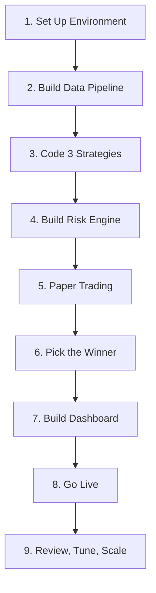

# Step-by-Step Implementation Process

This document outlines the sequential phases to construct, test, validate, and launch the trading bot.

---

---

## Step 1: Set Up the Environment
* **Timeline:** 2–3 Days
* **Status:** Start Here
* **What We Do:**
  * Install Python 3.10+.
  * Create a clean project folder structure with virtual environment (`venv`).
  * Install dependencies: `ccxt`, `pandas-ta`, `apscheduler`, `python-dotenv`, `sqlite3`, `streamlit`, and `vectorbt`.
  * Set up a test account on Binance (Sandbox/Testnet).
  * Generate API keys with read/trade permissions (ensure withdrawal permissions are disabled).
* **Why It Matters:** You cannot build anything without a clean, secure foundation. One wrong API key configuration can drain your account.
* **Done When:** A basic Python test script successfully connects to the exchange API and fetches the current BTC/USDT price without errors.

---

## Step 2: Build the Data Pipeline
* **Timeline:** 3–5 Days
* **Status:** Core Engine
* **What We Do:**
  * Write a scheduler using `APScheduler` to fetch OHLCV (candle) data from the exchange every 15 minutes.
  * Integrate `pandas-ta` to calculate indicators (RSI, Bollinger Bands, EMA) on the retrieved data.
  * Initialize an SQLite database and write schema for logging market data and indicator values.
* **Why It Matters:** All strategies depend on clean, real-time indicator data. If this layer breaks, the strategies receive garbage data and execute bad trades.
* **Done When:** The script runs continuously on a loop, fetches fresh data, calculates indicators correctly, and logs records to the SQLite database without crashing.

---

## Step 3: Code the 3 Strategies
* **Timeline:** 5–7 Days
* **Status:** Brain Layer
* **What We Do:**
  * Implement three independent strategy modules:
    1. **RSI Mean Reversion:** Trades oversold/overbought pullbacks.
    2. **Bollinger Band Bounce:** Trades price extremes returning to the mean.
    3. **EMA Crossover:** Captures short-term trends.
  * Ensure each module reads from SQLite, computes its signal (BUY, SELL, or HOLD), and returns it systematically.
* **Why It Matters:** Running three strategies in parallel allows for empirical comparison under identical market conditions. Never rely on a single approach.
* **Done When:** All three strategies output signals independently, and you can see output logs like `"Strategy A: BUY"`, `"Strategy B: HOLD"`, `"Strategy C: SELL"` printed in execution logs.

---

## Step 4: Build the Risk Engine
* **Timeline:** 3–4 Days
* **Status:** Critical Guard
* **What We Do:**
  * Write a risk manager module that intercepts signals before execution.
  * Enforce rules:
    * Max ₹200 position size per trade.
    * Max 3 open trades simultaneously.
    * Strict hardcoded stop loss (SL) and take profit (TP) triggers.
    * 30-minute cooldown period after any realized loss.
    * Weekly ₹100 drawdown cap (automatically halts new trades if hit).
* **Why It Matters:** This is the most critical module in the codebase. Strategies fail. The risk engine prevents capital ruin when they do.
* **Done When:** You write unit tests to simulate edge cases (e.g., triggering a simulated large loss, trying to open 4 concurrent positions) and confirm the risk engine blocks and handles them correctly.

---

## Step 5: Connect to Paper Trading
* **Timeline:** 3–4 Weeks (Running)
* **Status:** Simulation
* **What We Do:**
  * Route the execution client to Binance Testnet (sandbox environment).
  * Let the bot execute all three strategies simultaneously using a simulated ₹1,000 weekly budget.
  * Log every trade in SQLite: entry timestamp/price, exit timestamp/price, fees, net profit/loss, and the strategy ID that generated the signal.
* **Why It Matters:** It exposes the bot to live market data streams and execution cycles with zero financial risk, highlighting concurrency bugs or order placement errors.
* **Done When:** The bot executes continuously for 7 days straight without crashing, and generates complete trade logs in SQLite.

---

## Step 6: Analyze & Pick the Winner
* **Timeline:** 2–3 Days (Analysis)
* **Status:** Decision
* **What We Do:**
  * Load paper trading databases.
  * Calculate performance metrics for each strategy: win rate, average profit per trade, max drawdown, and Sharpe ratio.
  * Promote the single best-performing strategy to live trading.
  * Pause or refine the underperforming strategies.
* **Why It Matters:** Quantitative data must dictate which strategy manages real capital — not gut feeling.
* **Done When:** A clear winning strategy is selected (e.g., win rate >55%, average profit per trade >0.4% post-slippage/fees) and documented with performance statistics.

---

## Step 7: Build the Dashboard
* **Timeline:** 3–5 Days
* **Status:** Visibility
* **What We Do:**
  * Build a local web interface using `Streamlit`.
  * Read from SQLite databases to display: live unrealized P&L, realized equity curves, historical trade logs, strategy performance charts, and risk engine limits.
* **Why It Matters:** When trading live, you must be able to audit the bot's health at a glance without parsing raw SQLite records or console outputs.
* **Done When:** The dashboard loads instantly, automatically updates as new trades are logged, and highlights the current risk exposure level.

---

## Step 8: Go Live — Week 1
* **Timeline:** 1 Week
* **Status:** Real Money
* **What We Do:**
  * Switch configuration keys to the live Binance account funded with ₹1,000.
  * Activate *only* the promoted winning strategy.
  * Set up Telegram bot integration to receive push notifications on key events (orders placed, fills, stop-losses hit).
  * Manually monitor trades for the first week.
* **Why It Matters:** Real-world execution introduces slippage, exchange fees, and latency that did not occur on the testnet.
* **Done When:** The bot completes one week of real-money trading, stop-losses/take-profits execute successfully, and telemetry signals match local expectations.

---

## Step 9: Review, Tune, Scale
* **Timeline:** Ongoing
* **Status:** Operations
* **What We Do:**
  * Conduct weekly performance and database reviews.
  * Assess market regime shifts (sideways vs. trending).
  * If the bot records 2 profitable weeks in a row, consider incrementing the weekly funding cap.
  * If the win rate drops below 50% for 2 consecutive weeks, pause live trading for parameter tuning.
* **Why It Matters:** Markets shift. A profitable model can degrade. Continuous maintenance is required to maintain alpha.
* **Done When:** This is a continuous lifecycle of development, testing, and execution.
